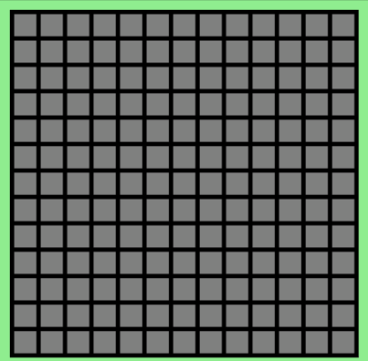
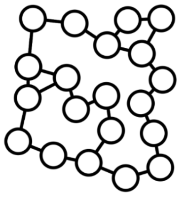

# path-finder :detective:
Finds the shortest path between two points in a grid or a network.
 

# Execution
Double-click the executable JAR or run `mvn clean javafx:run` from the root folder.

# Usage
1. Left-click to place the start node, then left-click again on another spot to place the end node.
2. Click a node and drag it to move it. 
3. Press the spacebar to find the shortest path between the nodes.

| Input         | Effect                                                            |
|---------------|-------------------------------------------------------------------|
| Left-Click    | Place Start/End Node or Clear Wall                                |
| Mouse Drag    | Move Start/End Node                                               |
| Spacebar      | Find shortest path between start and end nodes, with animation    |
| G             | Create a grid network of nodes                                    |
| W             | Create a web network of nodes                                     |
| F             | Find path between the two nodes with no animation                 |
